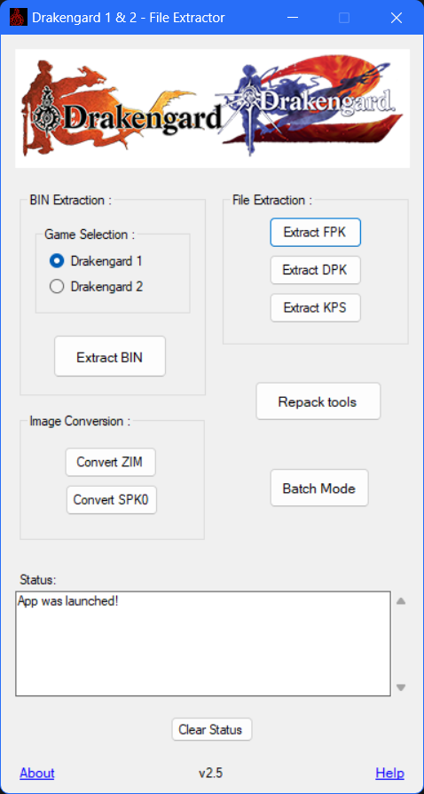

# Drakengard1and2Extractor
 
  
This small C# Winforms based GUI app should help in extracting and converting few file types from the PS2 games, Drakengard 1 and 2.   
 For app usage and more info on the file formats supported by this app, please refer to the Help option available on the app.

# For Developers
Use the minilz0.dll files included in the libraries folder along with the *MiniLz0Lib.cs* file, to use the minilz0 decompressor in your compiled build.

# Special Thanks
[**Joschuka**](https://github.com/Joschuka)
 [**Kizari**](https://github.com/Kizari)
 [**Tanuj**](https://github.com/Cyraphim)
 [**TopazTK**](https://github.com/TopazTK)
